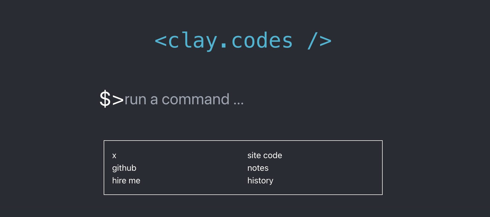

# clay.codes (next)

Moving my main [clay.codes](https://clay.codes) site to [remix](https://remix.run) 💿 and playing with [view transitions](https://remix.run/docs/en/v1/hooks/view-transitions) to create the main terminal view.

[nextclaycodes.netlify.app](https://nextclaycodes.netlify.app)
